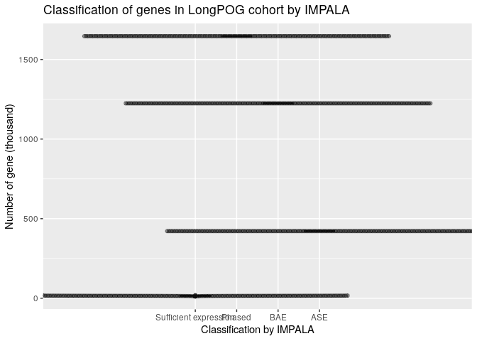

Generate of ASE figures
================
Glenn Chang

This is an R markdown is used to generate figures for ASE. The following
chunk loads in the required library and imports the data. The ASE data
is obtain through the IMPALA pipeline which can be found here:
<https://github.com/bcgsc/IMPALA>

``` r
suppressMessages(library(tidyverse))
suppressMessages(library(ggpubr))
suppressMessages(library(MetBrewer))
suppressMessages(library(ggbeeswarm))
suppressMessages(library(data.table))
options(dplyr.summarise.inform = FALSE)

# Import ASE data
#data_2 <- read_delim("https://www.bcgsc.ca/downloads/nanopore_pog/ASE/impalaResultAnonymous.tsv.gz", show_col_types = FALSE)
data <- fread("https://www.bcgsc.ca/downloads/nanopore_pog/ASE/impalaResultAnonymous.tsv.gz")

# Import expression matrix data
#expressionMatrix <- read_delim("https://www.bcgsc.ca/downloads/nanopore_pog/ASE/expressionMatrix.tsv.gz", show_col_types = FALSE)
expressionMatrix <- fread("https://www.bcgsc.ca/downloads/nanopore_pog/ASE/expressionMatrix.tsv.gz")
```

# ASE overview

This figure shows how genes were classified and filtered in the IMPALA
pipeline. Genes with insufficient expression (below 1 TPM) or contained
zero phased SNPs were filtered out. The remaining genes were then
classified as allelically expressed or biallelically expressed by
MBASED.

``` r
expressionMatrix <- expressionMatrix %>%
  dplyr::filter(gene %in% unique(data$gene))


final <- tibble()

for (sample in unique(data$sample)) {
  curr <- data[data$sample == sample, ]
  
  if (sample %in% colnames(expressionMatrix)) {
    exp <- expressionMatrix %>%
    dplyr::select(gene, sample) %>%
    `colnames<-`(c("gene", "sample"))
  } else {
    next
  }
  
  highExp <- exp %>%
    dplyr::filter(sample >= 1) %>%
    pull(gene)
  
  phased <- length(curr$gene)
  
  ASE <- nrow(curr[curr$aseResults == "ASE", ])
  BAE <- nrow(curr[curr$aseResults == "BAE", ])
  
  final <- bind_rows(final, tibble(sample = sample, `Sufficient expression` = length(highExp), Phased = phased, ASE = ASE, BAE = BAE))
}

final <- final %>%
  pivot_longer(-sample) 
  

final$name <- factor(final$name , levels=c("Sufficient expression", "Phased", "BAE", "ASE"))


final %>% 
  dplyr::mutate(value = value / 1000) %>%
  dplyr::mutate(type = case_when(
    name %in% c("ASE", "BAE") ~ name,
    T ~ NA
  )) %>%
  ggplot(aes(name, value)) + 
  theme(legend.position="none") + 
  geom_boxplot(aes(name, value, fill = type)) + 
  geom_beeswarm(alpha = 0.4) + 
  ylab("Number of gene (thousand)") + 
  xlab("Classification by IMPALA") + 
  ggtitle("Classification of genes in LongPOG cohort by IMPALA") 
```

<!-- -->

# CNV figures

This figure shows the violin plot showing proportion of ASE and BAE gene
in each CNV states.

``` r
total <- data %>%
  dplyr::filter(!is.na(cnv_state)) %>%
  group_by(sample, cnv_state) %>%
  summarize(total=n())

ase <- data %>%
  dplyr::filter(!is.na(cnv_state)) %>%
  dplyr::filter(padj <= 0.05) %>%
  group_by(sample, aseResults, cnv_state) %>%
  summarize(n=n())

prop <- left_join(ase, total, by = join_by(sample, cnv_state)) %>%
  dplyr::mutate(prop = n/total) 

ggviolin(
  prop, x = "aseResults", y = "prop", fill = "aseResults", 
  facet.by = "cnv_state") + 
  stat_compare_means(aes(label = after_stat(p.signif)),
                     comparisons = list( c("ASE", "BAE") ), 
                     method = "wilcox.test", label.y = 1.1) + 
  geom_boxplot(width=0.1, color="white", alpha=0.2) +
  scale_colour_met_d('Renoir') +
  theme(panel.grid.major = element_blank(),
    panel.grid.minor = element_blank(),
    panel.background = element_blank(),
    legend.position="none", 
    plot.title = element_text(face = "bold")) + 
  ggtitle("Propotion of genes \nin each CNV state") + 
  ylab("Propotion of genes") 
```

<!-- -->

Figure to show correlation between expected major allele frequency and
the mbased major allele frequency. The expected major allele frequency
can be calculated using the formula below:

\$ expectedMAF = (\* tumorContent) + (normalMAF \* (1-tumorContent)) \$

``` r
data_filt <- data %>%
  dplyr::filter(padj < 0.05) %>%
  dplyr::filter(!is.na(cnv_state)) %>%
  dplyr::filter(!is.na(normalMAF)) %>%
  dplyr::filter(expectedMAF <= 1 & expectedMAF >= 0.5)

correlation <- cor.test(data_filt$majorAlleleFrequency, data_filt$expectedMAF, 
                        method = c("pearson"))

data_filt %>%
  ggplot(aes(x=majorAlleleFrequency, y=expectedMAF) ) +
  stat_density_2d(aes(fill = after_stat(density)), geom = "raster", contour = FALSE) +
  scale_x_continuous(expand = c(0, 0)) +
  scale_y_continuous(expand = c(0, 0)) +
  scale_fill_continuous(type = "viridis") + 
  ggtitle("Correlation between expected \nand experimental MAF", 
          subtitle = paste0("Pearson Correlation: ",
                            format(correlation$estimate, digits=4))) +
  theme(legend.position = "none", 
        plot.title = element_text(face = "bold")) +
  theme(plot.subtitle=element_text()) + 
  scale_colour_met_d('Renoir')
```

<!-- -->

# Allelic Methylation figure

Figure to show allelic methylation silencing. Methylation silencing is
defined as cases with allelic methylation on the opposite allele as the
major expressing allele.

``` r
geneTotal <- data %>%
  dplyr::filter(padj < 0.05) %>%
  dplyr::filter(cnv_state == "balance") %>%
  group_by(aseResults, sample) %>%
  summarize(totalN=n())

data_filt <- data %>%
  dplyr::filter(padj < 0.05) %>%
  dplyr::filter(!is.na(methyl_state)) %>%
  dplyr::filter(!is.na(allele1IsMajor)) %>%
  dplyr::filter(cnv_state == "balance") %>%
  dplyr::mutate(allele1IsMethyl = methyl_state > 0) %>% 
  dplyr::mutate(methylSilencing = case_when(
    allele1IsMethyl & !allele1IsMajor ~ T,
    !allele1IsMethyl & allele1IsMajor ~ T,
    allele1IsMethyl & allele1IsMajor ~ F,
    !allele1IsMethyl & !allele1IsMajor ~ F
  )) %>%
  group_by(aseResults, sample, methylSilencing) %>%
  summarize(n=n()) %>%
  left_join(geneTotal, by = join_by(aseResults, sample)) %>%
  dplyr::mutate(prop = n/totalN) %>%
  dplyr::select(-n, -totalN)

data_filt %>%
  ggplot(aes(methylSilencing, prop)) +
  facet_grid(.~aseResults) + 
  geom_violin(aes(fill = methylSilencing)) +
  geom_boxplot(width=0.1, color="grey", alpha=0.2) +
  theme_bw() +
  theme(#axis.line = element_line(colour = "black"),
    panel.grid.major = element_blank(),
    panel.grid.minor = element_blank(),
    #panel.border = element_blank(),
    panel.background = element_blank(),
    legend.position="none") + 
  ggtitle("Allelic Methylation silencing \nin ASE vs BAE genes") +
  ylab("Proportion of ASE or BAE gene") + 
  xlab("Allelic Methylation Silencing") + 
  stat_compare_means(comparisons = list( c("TRUE", "FALSE") ))
```

<!-- -->
