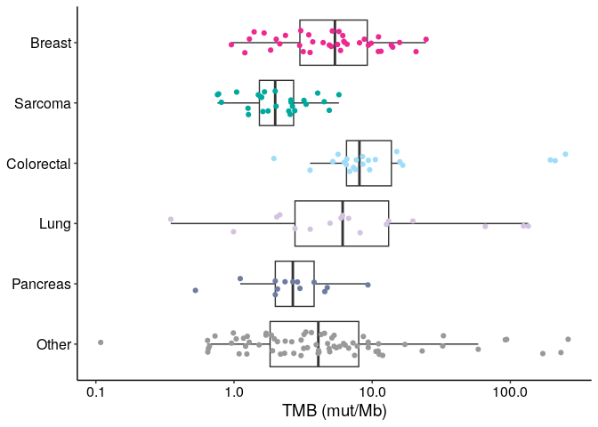
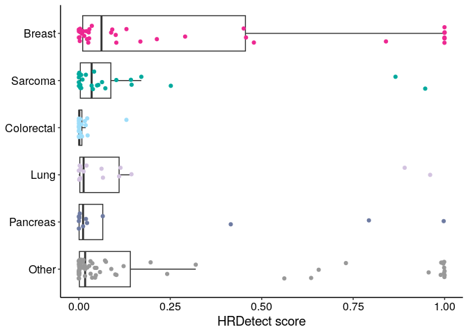
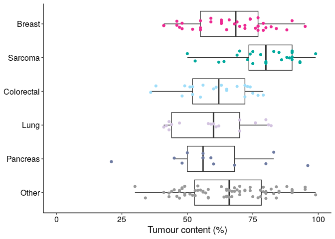

Cohort figure generation (Figure 1a,b and Extended Data Figure 1a)
================
Erin Pleasance
2024-02-14

This is an R markdown used to generate figures describing the overall
cohort.

## Tumour types (Figure 1a)

Plot tumour types and biopsy sites. After creating this plot, it was
further stretched and coloured in Illustrator.

``` r
# File with tumour type and biopsy groupings
#biopsy_data <- read.delim('https://www.bcgsc.ca/downloads/nanopore_pog/supplementary_tables/Supplementary_Table_1_samples.tsv')
biopsy_data_full <- fread('https://www.bcgsc.ca/downloads/nanopore_pog/supplementary_tables/Supplementary_Table_1_samples.tsv')


# Clean up the terms
biopsy_data <- biopsy_data_full %>% dplyr::select(anonymous_sample_ID_tumour, tumour_type_cohort, biopsy_site_cohort) %>%
  dplyr::rename(sample = anonymous_sample_ID_tumour, tumour_type = tumour_type_cohort, biopsy_group = biopsy_site_cohort)
biopsy_data <- biopsy_data %>% mutate(biopsy_group = gsub(" System", "", biopsy_group))
biopsy_data <- biopsy_data %>%
  mutate(
    tumour_type_group = case_when(
      tumour_type == "BRCA" ~ "BRCA",
      tumour_type == "SARC" ~ "SARC",
      tumour_type == "COLO" ~ "COLO",
      tumour_type == "LUNG" ~ "LUNG",
      tumour_type == "PANC" ~ "PANC",
      tumour_type == "OV" ~ "OV",
      tumour_type == "CHOL" ~ "CHOL",
      tumour_type == "CNS-PNS" ~ "CNS-PNS",
      tumour_type == "SKCM" ~ "SKCM",
      tumour_type == "LYMP" ~ "LYMP",
      tumour_type == "HNSC" ~ "HNSC",
      TRUE ~ "OTHER"
    )
  )

biopsy_data <- biopsy_data %>%
  mutate(
    biopsy_group = case_when(
      biopsy_group == "Liver" ~ "Liver",
      biopsy_group == "Lymphatic" ~ "Lymphatic",
      biopsy_group == "Respiratory" ~ "Respiratory",
      biopsy_group == "Chest Wall" ~ "Chest Wall",
      biopsy_group == "Soft Tissue" ~ "Soft Tissue",
      biopsy_group == "Reproductive" ~ "Reproductive",
      biopsy_group == "Breast" ~ "Breast",
      biopsy_group == "Abdomen" ~ "Abdomen",
      biopsy_group == "Head & Neck" ~ "Head & Neck",
      biopsy_group == "Spine" ~ "Spine",
      biopsy_group == "Skin" ~ "Skin",
      biopsy_group == "Brain" ~ "Brain",
      TRUE ~ "Other"
    )
  )


# Group data into counts for each cohort (tumour type) and biopsy pair
freqs <- biopsy_data %>% group_by(tumour_type_group, biopsy_group) %>% summarise(n())

# Add colours
freqs <- freqs %>% 
  mutate(
    cohort_colour = case_when(
      tumour_type_group == "BRCA" ~ "#ED2891",
      tumour_type_group == "SARC" ~ "#00A99D",
      tumour_type_group == "COLO" ~ "#9EDDF9",
      tumour_type_group == "LUNG" ~ "#D3C3E0",
      tumour_type_group == "PANC" ~ "#6E7BA2",
      tumour_type_group == "OV" ~ "#D97D25",
      tumour_type_group == "CHOL" ~ "#104A7F",
      tumour_type_group == "CNS-PNS" ~ "#B2509E",
      tumour_type_group == "SKCM" ~ "#BBD642",
      tumour_type_group == "LYMP" ~ "#009444",
      tumour_type_group == "HNSC" ~ "#00AEEF", #used the old STAD colour as HNSC had too few to get a colour
      tumour_type_group == "OTHER" ~ "#999999",
      TRUE ~ "#999999"
    )
  )

# Order groups on figure
freqs$tumour_type_group <- factor(freqs$tumour_type_group, levels=c("BRCA", "SARC", "COLO", "LUNG", "PANC", "OV", "CHOL", "CNS-PNS", "SKCM", "LYMP", "HNSC", "OTHER"))
freqs$biopsy_group <- factor(freqs$biopsy_group, levels=c("Liver", "Lymphatic", "Respiratory", "Chest Wall", "Soft Tissue", "Reproductive", "Breast", "Abdomen", "Head & Neck", "Spine", "Skin", "Brain", "Other"))


# Plot
alluvial(freqs[,1:2], freq=freqs$`n()`, hide = freqs$`n()` < 2, 
         col = freqs$cohort_colour, 
         border=freqs$cohort_colour, 
         gap.width=0.2, 
         xw=0.2, 
         alpha = 0.6
         )
```

<!-- -->

## Tumour genomic features (Figure 1b)

Plot HRD, TMB, tumour content for each of the tumour groups.

``` r
#File with genomic features (same as file used above)

samples <- read.delim('https://www.bcgsc.ca/downloads/nanopore_pog/supplementary_tables/Supplementary_Table_1_samples.tsv')

# Group tumour types into larger group and create 'OTHER' 

samples$Tumour_type <- case_when(
  samples$tumour_type_cohort =="BRCA" ~ "Breast",
  samples$tumour_type_cohort =="SARC" ~ "Sarcoma",
  samples$tumour_type_cohort =="COLO" ~ "Colorectal",
  samples$tumour_type_cohort =="LUNG" ~ "Lung",
  samples$tumour_type_cohort =="PANC" ~ "Pancreas",
  TRUE ~ "Other"
)

samples$Tumour_type <- factor(samples$Tumour_type, levels = c("Breast", "Sarcoma", "Colorectal", "Lung", "Pancreas", "Other"))

# Tumour type colours
cohortPalette <-c("#ED2891", "#00A99D", "#9EDDF9", "#D3C3E0", "#6E7BA2", "#999999")
names(cohortPalette) <-c("Breast", "Sarcoma", "Colorectal", "Lung", "Pancreas", "Other") 

# Boxplot of TMB by tumour type
ggplot(samples %>% group_by(Tumour_type), aes(x = Tumour_type, y = TMB)) +
  geom_boxplot(outlier.shape = NA) + geom_jitter(height=0, width=0.2, aes(color=Tumour_type)) +
  scale_colour_manual(values=cohortPalette) +
  scale_x_discrete(limits=rev) +
  scale_y_continuous(trans='log10') +
  coord_flip() +
  ylab("TMB (mut/Mb)") +
  theme_classic() +
  theme(axis.title.y=element_blank(), axis.text.y=element_text(size=12, colour="black"),
        axis.title.x=element_text(size=14, colour="black"), axis.text.x=element_text(size=12, colour="black"),
        legend.position="none")
```

<!-- -->

``` r
# Boxplot of HRDetect by tumour type
ggplot(samples %>% group_by(Tumour_type), aes(x = Tumour_type, y = HRDetect)) +
  geom_boxplot(outlier.shape = NA) + geom_jitter(height=0, width=0.2, aes(color=Tumour_type)) +
  scale_colour_manual(values=cohortPalette) +
  scale_x_discrete(limits=rev) +
  coord_flip() +
  ylab("HRDetect score") +
  theme_classic() +
  theme(axis.title.y=element_blank(), axis.text.y=element_text(size=12, colour="black"),
        axis.title.x=element_text(size=14, colour="black"), axis.text.x=element_text(size=12, colour="black"),
        legend.position="none")
```

<!-- -->

``` r
# Boxplot of tumour content by tumour type
ggplot(samples %>% group_by(Tumour_type), aes(x = Tumour_type, y = tumour_content)) +
  geom_boxplot(outlier.shape = NA) + geom_jitter(height=0, width=0.2, aes(color=Tumour_type)) +
  #  geom_boxplot() + geom_beeswarm() +
  scale_color_manual(values=cohortPalette) +
  #  scale_fill_manual(values=cohortPalette) +
  scale_x_discrete(limits=rev) +
  coord_flip() +
  ylab("Tumour content (%)") +
  ylim(0,100) +
  theme_classic() +
  theme(axis.title.y=element_blank(), axis.text.y=element_text(size=12, colour="black"),
        axis.title.x=element_text(size=14, colour="black"), axis.text.x=element_text(size=12, colour="black"),
        legend.position="none")
```

<!-- -->
