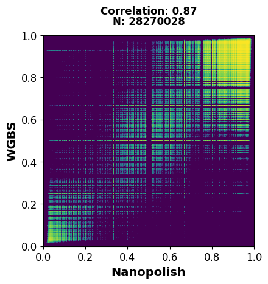

```python
# Modules to import - get rid of any not used - add to dockfile in github
import pandas as pd
import scipy
import datashader as ds
from datashader.mpl_ext import dsshow
import scipy.stats
import matplotlib.pyplot as plt
from matplotlib.colors import LinearSegmentedColormap
import ssl
from urllib.request import urlopen

```

    /opt/conda/lib/python3.11/site-packages/dask/dataframe/__init__.py:49: FutureWarning: 
    Dask dataframe query planning is disabled because dask-expr is not installed.
    
    You can install it with `pip install dask[dataframe]` or `conda install dask`.
    This will raise in a future version.
    
      warnings.warn(msg, FutureWarning)


```python
# import data - make sure to change to data from GSC website

# use ssl to securely open csv before loading into pandas dataframe
data_loc = 'https://www.bcgsc.ca/downloads/nanopore_pog/Methylation/POG044_BS_Nanopolish_Meth.bed.gz'

context=ssl.create_default_context()
context.set_ciphers("DEFAULT")
result = urlopen(data_loc, context=context)

POG044_BS_Nano_df = pd.read_csv(result, sep="\t",header=None, compression='gzip')

```


```python
# get columns of interest and drop null rows - i.e. BS methylation frequency and nanopore frequency
POG044_BS_Nano_df_filt = POG044_BS_Nano_df.iloc[:,[2,3]].dropna()
```


```python
# calculate rho and value using pearson correlation for BS and Nanopolish frequencies
r_BS_Nano, p_BS_Nano = scipy.stats.pearsonr(POG044_BS_Nano_df_filt[2].values, POG044_BS_Nano_df_filt[3].values)

```


```python
#Visualize Methylation Correlation using datashader - use figure axe 
def using_datashader(ax, x, y):

    # create dataframe
    df = pd.DataFrame(dict(x=x, y=y))
    
    # plot data using viridis cmap and 1 to 1 scale 
    dsartist = dsshow(
        df,
        ds.Point("x", "y"),
        ds.count(),
        norm="eq_hist",
        aspect="auto",
        cmap=viridis_cmap,
        width_scale=1,
        height_scale=1,
        ax=ax
    )

#viridis cmap
viridis_cmap = LinearSegmentedColormap.from_list('white_viridis', [
    (0, '#440053'),
    (0.20, '#404388'),
    (0.40, '#2a788e'),
    (0.60, '#21a784'),
    (0.80, '#78d151'),
    (1, '#fde624'),
], N=256)
```


```python


# Plot 5mC Results 
fig, ax = plt.subplots()
using_datashader(ax, POG044_BS_Nano_df_filt[2], POG044_BS_Nano_df_filt[3])
# set background color and make aspect equal
ax.set_facecolor('#440053')
ax.set_aspect('equal', adjustable='box')
# set lables
plt.ylabel('WGBS', fontsize = 14, weight="bold")
plt.xlabel('Nanopolish', fontsize = 14, weight="bold")
plt.xlim(0,1)
plt.ylim(0,1)
plt.text(0.5, 1.1, f'Correlation: {round(r_BS_Nano,2)}', transform=ax.transAxes, ha='center', fontsize = 12, weight="bold")
plt.text(0.5, 1.05, f'N: {len(POG044_BS_Nano_df_filt)}', transform=ax.transAxes, ha='center', fontsize = 12, weight="bold")
ax.tick_params(axis='both', labelsize=12)
plt.tight_layout()

plt.savefig("Methylation_Fig4a.pdf", format="pdf", dpi = 70)
```


    

    

