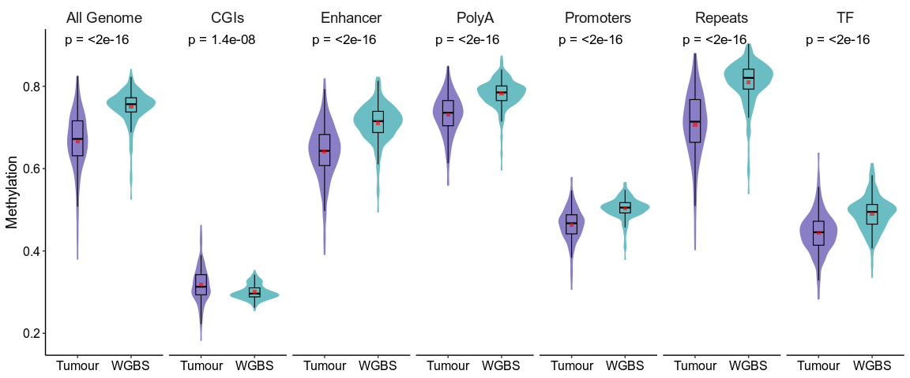
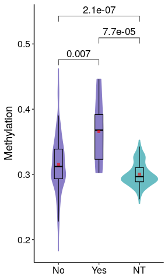
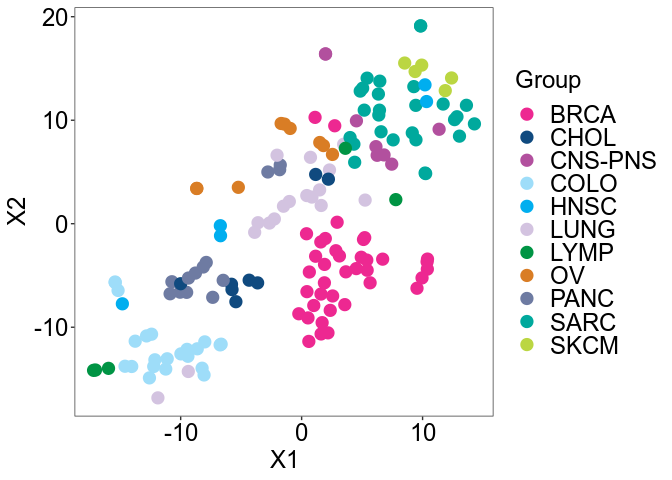
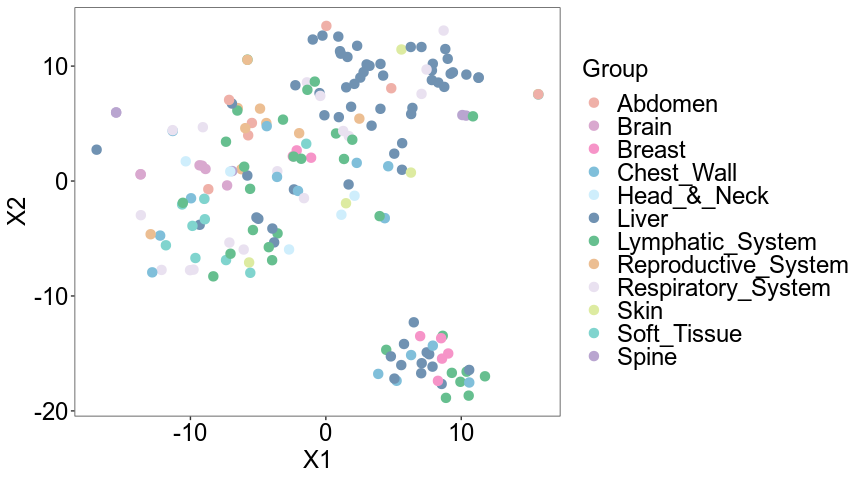
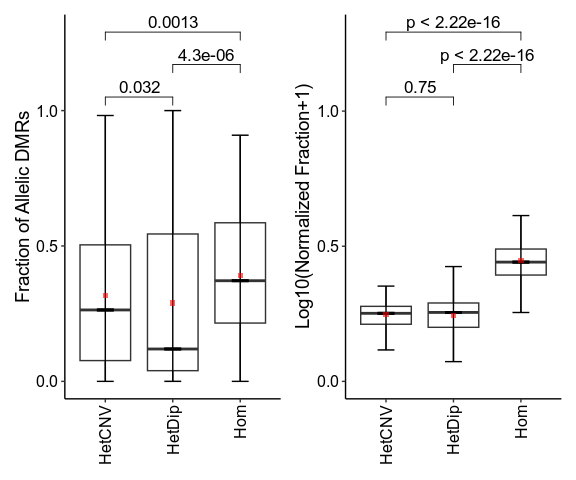
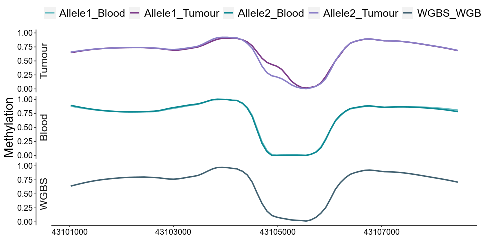
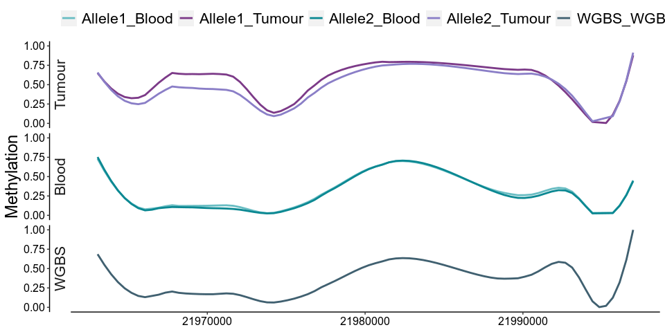
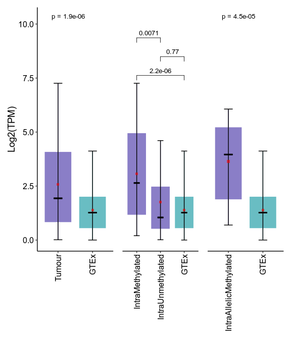
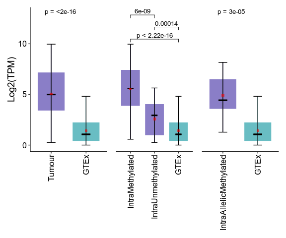

Codes to generate methylation plots
================
Vahid Akbari

This R markdown includes codes to generate methylation related figures,
inlcuding allelic and non-allelic methylation.

# Import required libraries

``` r
suppressMessages(library(tidyverse))
suppressMessages(library(ggpubr))
suppressMessages(library(M3C))
suppressMessages(library(reshape2))
suppressMessages(library(data.table))
suppressMessages(library(patchwork))
```

# Import data and plot overal methylation

This will generate overall methylation in tumour samples and normal WGBS
cases.

<!-- -->

Overall methylation with respect to mutation status in TET and IDH at
CGIs
<!-- -->

# t-SNE based on tumour type

<!-- -->

# t-SNE based on biopsy site

<!-- -->

# Fraction of allelic DMRs based on copy number status

<!-- -->

# RET methylation plot

    ## Rows: 1515522 Columns: 10
    ## ── Column specification ────────────────────────────────────────────────────────
    ## Delimiter: "\t"
    ## chr (8): ID, Sample, Lib, Type, Class, Allele, Chromosome, Gene
    ## dbl (2): Position, Methylation
    ## 
    ## ℹ Use `spec()` to retrieve the full column specification for this data.
    ## ℹ Specify the column types or set `show_col_types = FALSE` to quiet this message.
    ## `summarise()` has grouped output by 'ID', 'Type', 'Class', 'Allele', 'Position'. You can override using the `.groups` argument.
    ## `geom_smooth()` using formula = 'y ~ x'

<!-- -->

# CDKN2A methylation plot

    ## `geom_smooth()` using formula = 'y ~ x'

<!-- -->

# RET Expression box plots

    ## Rows: 35138 Columns: 6
    ## ── Column specification ────────────────────────────────────────────────────────
    ## Delimiter: "\t"
    ## chr (5): ID, Sample, Gene, Type, Category
    ## dbl (1): TPM
    ## 
    ## ℹ Use `spec()` to retrieve the full column specification for this data.
    ## ℹ Specify the column types or set `show_col_types = FALSE` to quiet this message.
    ## `summarise()` has grouped output by 'ID', 'Gene', 'Type'. You can override using the `.groups` argument.

<!-- -->

# CDKN2A Expression box plots

<!-- -->
