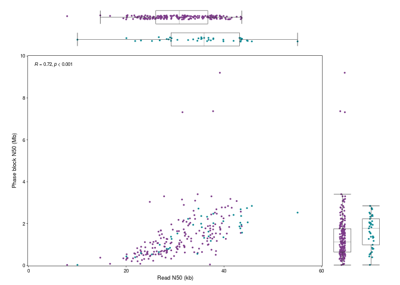
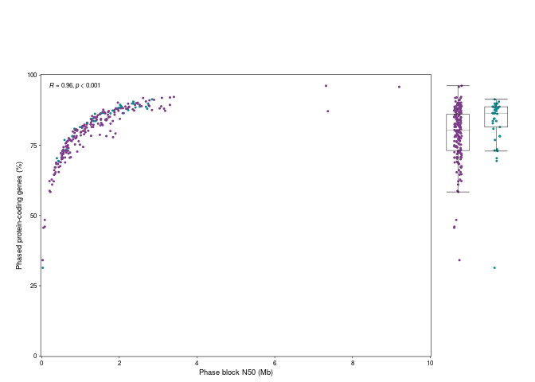
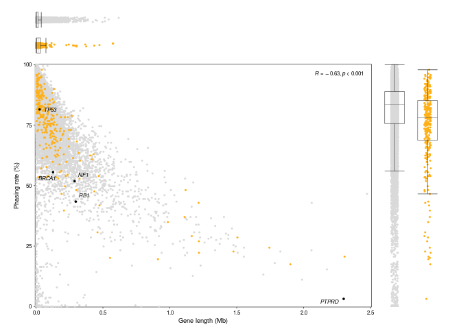

Phasing figures
================
Katherine Dixon
2024-03-05

This is an R markdown used to generate figures describing phasing.

# Loading data

``` r
#Load data
info <- read.table('https://www.bcgsc.ca/downloads/nanopore_pog/supplementary_tables/Supplementary_Table_1_samples.tsv', sep = '\t', header = T)
phasing <- read.csv('https://www.bcgsc.ca/downloads/nanopore_pog/phasing/phasing-stats.csv')
census <- read.csv('https://www.bcgsc.ca/downloads/nanopore_pog/phasing/cosmic-gene-census.csv')
tumours <- read.csv('https://www.bcgsc.ca/downloads/nanopore_pog/phasing/ensembl100-genes+promoters-blocks-summary-tumours.csv')

#Set colours
palette <- c('#7C3A88', '#8A7EC7', '#69BDC3', '#0B8892')
colours <- c('tumour' = palette[1], 'normal' = palette[4])
fills <- c('tumour' = 'white', 'normal' = 'white')
```

## Read N50 by tissue type

``` r
#Generate figure panels
#Panel a (left) scale
xmax <- 60
ymax <- 10

#Panel a (left): read N50 by tissue type
boxplot.reads.data <- ggplot(phasing, aes(x = tissue, y = read.n50/1000)) +
  geom_boxplot() +
  scale_x_discrete(limits = rev(c('tumour', 'normal')))

boxplot.reads <- ggplot(phasing, aes(x = tissue, y = read.n50/1000)) +
  geom_point(aes(colour = tissue), size = 0.4, position = position_jitter(width = 0.1, height = 0)) +
  geom_boxplot(size = 0.2, fatten = 0.5, width = 0.6, outlier.shape = NA, fill = NA) +
  geom_segment(data = layer_data(boxplot.reads.data), aes(x = x - 0.3, xend = x + 0.3, y = ymin, yend = ymin), linewidth = 0.2) +
  geom_segment(data = layer_data(boxplot.reads.data), aes(x = x - 0.3, xend = x + 0.3, y = ymax, yend = ymax), linewidth = 0.2) +
  theme(panel.background = element_blank(),
        panel.grid = element_blank(),
        axis.ticks = element_line(colour = 'white', linewidth = 0.2),
        axis.ticks.length = unit(0.6, 'mm'),
        axis.title = element_text(size = 7, colour = 'white'),
        axis.title.x = element_blank(),
        axis.text = element_text(size = 6, colour = 'white'),
        axis.text.x = element_blank(),
        legend.position = 'none',
        plot.margin = margin(5, 1, 1, 15),
        plot.background = element_rect(colour = 'transparent', fill = 'transparent')) +
  scale_colour_manual(values = colours) +
  scale_x_discrete(limits = rev(c('tumour', 'normal')), labels = c(ymax, ymax)) +
  scale_y_continuous(expand = c(0.002, 0.002), limits = c(0, xmax)) +
  coord_flip()
```

## Read N50 by blocks size

``` r
#Panel a (left): read N50 by block size
scatterplot.reads <- ggplot(phasing, aes(x = read.n50/1000, y = block_n50/1000000)) +
  geom_point(aes(colour = tissue), size = 0.4) +
  stat_cor(p.accuracy = 0.001, r.accuracy = 0.01, size = 2.1, label.x = 1.2, label.y = 9.6, method = 'spearman') +
  theme(panel.background = element_rect(fill = 'white', colour = 'black', linewidth = 0.2),
        panel.grid = element_blank(),
        axis.ticks = element_line(colour = 'black', linewidth = 0.2),
        axis.ticks.length = unit(0.6, 'mm'),
        axis.title = element_text(size = 7),
        axis.text = element_text(size = 6, colour = 'black'),
        legend.position = 'none',
        plot.margin = margin(1, 1, 5, 15),
        plot.background = element_rect(colour = 'transparent', fill = 'transparent')) +
  scale_colour_manual(values = colours) +
  scale_y_continuous(name = 'Phase block N50 (Mb)', labels = scales::comma, expand = c(0.002, 0.002), limits = c(0, ymax), breaks = c(0, 2, 4, 6, 8, 10)) +
  scale_x_continuous(name = 'Read N50 (kb)', labels = scales::comma, expand = c(0.002, 0.002), limits = c(0, xmax), breaks = c(0, 20, 40, 60)) +
  coord_cartesian(clip = 'off')
```

## Block size by tissue type

``` r
#Panel a (left): block size by tissue type
boxplot.blocks.data <- ggplot(phasing, aes(x = tissue, y = block_n50/1000000)) +
  geom_boxplot() +
  scale_x_discrete(limits = c('tumour', 'normal'))

boxplot.blocks <- ggplot(phasing, aes(x = tissue, y = block_n50/1000000)) +
  geom_point(aes(colour = tissue), size = 0.4, position = position_jitter(width = 0.1, height = 0)) +
  geom_boxplot(size = 0.2, fatten = 0.5, width = 0.6, outlier.shape = NA, fill = NA) +
  geom_segment(data = layer_data(boxplot.blocks.data), aes(x = x - 0.3, xend = x + 0.3, y = ymin, yend = ymin), linewidth = 0.2) +
  geom_segment(data = layer_data(boxplot.blocks.data), aes(x = x - 0.3, xend = x + 0.3, y = ymax, yend = ymax), linewidth = 0.2) +
  theme(panel.background = element_blank(),
        panel.grid = element_blank(),
        axis.ticks = element_line(colour = 'white', linewidth = 0.2),
        axis.ticks.length = unit(0.6, 'mm'),
        axis.title = element_text(size = 7, colour = 'white'),
        axis.title.y = element_blank(),
        axis.text = element_text(size = 6, colour = 'white'),
        axis.text.y = element_blank(),
        legend.position = 'none',
        plot.margin = margin(1, 15, 5, 1),
        plot.background = element_rect(colour = 'transparent', fill = 'transparent')) +
  scale_colour_manual(values = colours) +
  scale_x_discrete(limits = c('tumour', 'normal'), labels = c(xmax, xmax)) +
  scale_y_continuous(name = 'Phase block N50 (kb)', labels = scales::comma, expand = c(0.002, 0.002), limits = c(0, ymax))
```

## Block N50 by gene phasing rate

``` r
#Panel a (right) scale
ymax2 <- 100
xmax2 <- 10

#Panel a (right): block N50 by gene phasing rate
scatterplot.phasing <- ggplot(phasing, aes(x = as.numeric(block_n50)/1000000, y = ensembl100.coding.and.promoters.percent)) +
  geom_point(aes(colour = tissue), size = 0.4) +
  stat_cor(p.accuracy = 0.001, r.accuracy = 0.01, size = 2.1, label.x = xmax2*0.02, label.y = ymax2*0.96, method = 'spearman') +
  theme(panel.background = element_rect(fill = 'white', colour = 'black', linewidth = 0.2),
        panel.grid = element_blank(),
        axis.ticks = element_line(colour = 'black', linewidth = 0.2),
        axis.ticks.length = unit(0.6, 'mm'),
        axis.title = element_text(size = 7),
        axis.text = element_text(size = 6, colour = 'black'),
        legend.position = 'none',
        plot.margin = margin(1, 1, 5, 15),
        plot.background = element_rect(colour = 'transparent', fill = 'transparent')) +
  scale_colour_manual(values = colours) +
  scale_y_continuous(name = 'Phased protein-coding genes (%)', labels = scales::comma, expand = c(0.002, 0.002), limits = c(0, ymax2)) +
  scale_x_continuous(name = 'Phase block N50 (Mb)', labels = scales::comma, expand = c(0.002, 0.002), limits = c(0, xmax2), breaks = c(0, 2, 4, 6, 8, 10)) +
  coord_cartesian(clip = 'off')
```

## Gene phasing rate by tissue type

``` r
#Panel a (right): gene phasing rate by tissue type
boxplot.phasing.data <- ggplot(phasing, aes(x = tissue, y = ensembl100.coding.and.promoters.percent)) +
  geom_boxplot() +
  scale_x_discrete(limits = c('tumour', 'normal'))

boxplot.phasing <- ggplot(phasing, aes(x = tissue, y = ensembl100.coding.and.promoters.percent)) +
  geom_point(aes(colour = tissue), size = 0.4, position = position_jitter(width = 0.1, height = 0)) +
  geom_boxplot(aes(fill = tissue), size = 0.2, fatten = 0.5, width = 0.6, fill = NA, outlier.shape = NA) +
  geom_segment(data = layer_data(boxplot.phasing.data), aes(x = x - 0.3, xend = x + 0.3, y = ymin, yend = ymin), linewidth = 0.2) +
  geom_segment(data = layer_data(boxplot.phasing.data), aes(x = x - 0.3, xend = x + 0.3, y = ymax, yend = ymax), linewidth = 0.2) +
  theme(panel.background = element_blank(),
        panel.grid = element_blank(),
        axis.ticks = element_line(colour = 'white', linewidth = 0.2),
        axis.ticks.length = unit(0.6, 'mm'),
        axis.title = element_text(size = 7, colour = 'white'),
        axis.title.y = element_blank(),
        axis.text = element_text(size = 6, colour = 'white'),
        axis.text.y = element_blank(),
        legend.position = 'none',
        plot.margin = margin(1, 15, 5, 1),
        plot.background = element_rect(colour = 'transparent', fill = 'transparent')) +
  scale_fill_manual(values = fills) +
  scale_colour_manual(values = colours) +
  scale_x_discrete(limits = c('tumour', 'normal'), labels = c(xmax2, xmax2)) +
  scale_y_continuous(name = 'Phase block N50 (kb)', labels = scales::comma, expand = c(0.002, 0.002), limits = c(0, ymax2))
```

## Gene length by phasing rate

``` r
#Panel b data
genes <- census %>% filter(grepl('TSG', Role.in.Cancer)) %>% pull(Gene.Symbol)

data <- tumours %>%
  filter((gene_type == 'protein_coding') & (chromosome != 'chrX')) %>%
  mutate(length = (end - start)/1000,
         count = ifelse(is.na(count), 0, count),
         percent = ifelse(is.na(percent), 0, percent),
         group = ifelse(gene_name %in% genes, 'TSG', 'other'))

labels <- c('BRCA1', 'TP53', 'RB1', 'NF1', 'PTPRD')

gene.colour <- 'gray85'
tsg.colour <- '#FFB017'

#Panel b: gene length by phasing rate
scatterplot.genes <- ggplot(data %>% filter(!(gene_name %in% genes)), aes(x = length/1000, y = percent)) +
  geom_point(size = 0.4, colour = gene.colour) +
  geom_point(data = data %>% filter((gene_name %in% c(genes, 'CARS1')) & !(gene_name %in% labels)), colour = tsg.colour, size = 0.4) +
  geom_point(data = data %>% filter(gene_name %in% labels), size = 0.6) +
  geom_text_repel(data = data %>% filter(gene_name %in% labels), aes(label = gene_name), size = 2.1, fontface = 'italic') +
  stat_cor(p.accuracy = 0.001, r.accuracy = 0.01, size = 2.1, method = 'spearman', label.x = 2.5*0.98, label.y = 96, hjust = 1) +
  theme(panel.background = element_rect(fill = 'white', colour = 'black', linewidth = 0.2),
        panel.grid = element_blank(),
        axis.ticks = element_line(colour = 'black', linewidth = 0.2),
        axis.ticks.length = unit(0.6, 'mm'),
        axis.title = element_text(size = 7),
        axis.text = element_text(size = 6, colour = 'black'),
        plot.margin = margin(1, 1, 5, 15),
        plot.background = element_rect(colour = 'transparent', fill = 'transparent')) +
  scale_y_continuous(name = 'Phasing rate (%)', expand = c(0.002, 0.002), limits = c(0, 100)) +
  scale_x_continuous(name = 'Gene length (Mb)', labels = scales::comma, expand = c(0.002, 0.002), limits = c(0, 2.5)) +
  coord_cartesian(clip = 'off')
```

## Gene length by gene type

``` r
#Panel b: gene length by gene type
boxplot.length.data <- ggplot(data, aes(x = group, y = length/1000)) +
  geom_boxplot() +
  scale_x_discrete(limits = rev(c('other', 'TSG')))

boxplot.length <- ggplot(data, aes(x = group, y = length/1000)) +
  geom_point(aes(colour = group), size = 0.4, position = position_jitter(width = 0.1, height = 0)) +
  geom_boxplot(linewidth = 0.2, fatten = 0.5, width = 0.6, outlier.shape = NA, fill = NA) +
  geom_segment(data = layer_data(boxplot.length.data), aes(x = x - 0.3, xend = x + 0.3, y = ymin, yend = ymin), linewidth = 0.2) +
  geom_segment(data = layer_data(boxplot.length.data), aes(x = x - 0.3, xend = x + 0.3, y = ymax, yend = ymax), linewidth = 0.2) +
  theme(panel.background = element_blank(),
        panel.grid = element_blank(),
        axis.ticks = element_line(colour = 'white', linewidth = 0.2),
        axis.ticks.length = unit(0.6, 'mm'),
        axis.title = element_text(size = 7, colour = 'white'),
        axis.title.x = element_blank(),
        axis.text = element_text(size = 6, colour = 'white'),
        axis.text.x = element_blank(),
        legend.position = 'none',
        plot.margin = margin(5, 1, 1, 15),
        plot.background = element_rect(colour = 'transparent', fill = 'transparent')) +
  scale_colour_manual(values = c('TSG' = tsg.colour, 'other' = gene.colour)) +
  scale_x_discrete(limits = rev(c('other', 'TSG')), labels = c(ymax2, ymax2)) +
  scale_y_continuous(expand = c(0.002, 0.002), limits = c(0, xmax2)) +
  coord_flip()
```

## Gene phasing rate by gene type

``` r
#Panel b: gene phasing rate by gene type
boxplot.rate.data <- ggplot(data, aes(x = group, y = percent)) +
  geom_boxplot()

boxplot.rate <- ggplot(data, aes(x = group, y = percent)) +
  geom_point(aes(colour = group), size = 0.4, position = position_jitter(width = 0.1, height = 0)) +
  geom_boxplot(linewidth = 0.2, fatten = 0.5, width = 0.6, outlier.shape = NA, fill = NA) +
  geom_segment(data = layer_data(boxplot.rate.data), aes(x = x - 0.3, xend = x + 0.3, y = ymin, yend = ymin), linewidth = 0.2) +
  geom_segment(data = layer_data(boxplot.rate.data), aes(x = x - 0.3, xend = x + 0.3, y = ymax, yend = ymax), linewidth = 0.2) +
  theme(panel.background = element_blank(),
        panel.grid = element_blank(),
        axis.ticks = element_line(colour = 'white', linewidth = 0.2),
        axis.ticks.length = unit(0.6, 'mm'),
        axis.title = element_text(size = 7, colour = 'white'),
        axis.title.y = element_blank(),
        axis.text = element_text(size = 6, colour = 'white'),
        axis.text.y = element_blank(),
        legend.position = 'none',
        plot.margin = margin(1, 15, 5, 1),
        plot.background = element_rect(colour = 'transparent', fill = 'transparent')) +
  scale_colour_manual(values = c('TSG' = tsg.colour, 'other' = gene.colour)) +
  scale_fill_manual(values = c('TSG' = tsg.colour, 'other' = gene.colour)) +
  scale_y_continuous(name = 'Phasing rate (%)', limits = c(0, 100), expand = c(0.002, 0.002))
```

## Compiled figure 3a,b

``` r
#Plot panel layouts
empty.plot <- ggplot(phasing) + geom_blank() + theme_void()

a1 <- ggarrange(
  ggarrange(boxplot.reads, empty.plot, nrow = 1, widths = c(4.2, 1)),
  ggarrange(scatterplot.reads, boxplot.blocks, nrow = 1, widths = c(4.2, 1)),
  nrow = 2, heights = c(1, 4.2))
a2 <- ggarrange(
  ggarrange(empty.plot, empty.plot, nrow = 1, widths = c(4.2, 1)),
  ggarrange(scatterplot.phasing, boxplot.phasing, nrow = 1, widths = c(4.2, 1)),
  nrow = 2, heights = c(1, 4.2))
b <- ggarrange(
  ggarrange(boxplot.length, empty.plot, nrow = 1, widths = c(4.2, 1)),
  ggarrange(scatterplot.genes, boxplot.rate, nrow = 1, widths = c(4.2, 1)),
  nrow = 2, heights = c(1, 4.2))

a1
```

<!-- -->

``` r
a2
```

<!-- -->

``` r
b
```

<!-- -->

## Final layout and output as PDF (optional)

``` r
#Plot panel layouts
empty.plot <- ggplot(phasing) + geom_blank() + theme_void()

a1 <- ggarrange(
  ggarrange(boxplot.reads, empty.plot, nrow = 1, widths = c(4.2, 1)),
  ggarrange(scatterplot.reads, boxplot.blocks, nrow = 1, widths = c(4.2, 1)),
  nrow = 2, heights = c(1, 4.2))
a2 <- ggarrange(
  ggarrange(empty.plot, empty.plot, nrow = 1, widths = c(4.2, 1)),
  ggarrange(scatterplot.phasing, boxplot.phasing, nrow = 1, widths = c(4.2, 1)),
  nrow = 2, heights = c(1, 4.2))
b <- ggarrange(
  ggarrange(boxplot.length, empty.plot, nrow = 1, widths = c(4.2, 1)),
  ggarrange(scatterplot.genes, boxplot.rate, nrow = 1, widths = c(4.2, 1)),
  nrow = 2, heights = c(1, 4.2))

#Save figures in PNG and PDF
png('phasing-stats.png', width = 180, height = 54, units = 'mm', res = 400)
ggarrange(a1, a2, b, nrow = 1, labels = c('a', '', 'b'), font.label = list(size = 10))
dev.off()
```

    ## png 
    ##   2

``` r
pdf('phasing-stats.pdf', width = 18/2.54, height = 5.4/2.54)
ggarrange(a1, a2, b, nrow = 1, labels = c('a', '', 'b'), font.label = list(size = 10))
dev.off()
```

    ## png 
    ##   2
