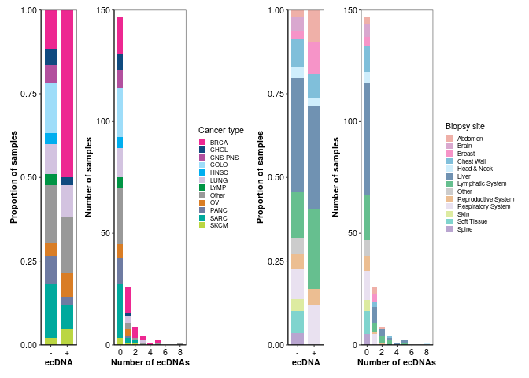

Extended_data_ecDNA_A
================
2023-08-31

## Loading in required packages

``` r
library(tidyverse)
library(patchwork)
```

## Loading in data

``` r
cancer_type <- read.delim("https://www.bcgsc.ca/downloads/nanopore_pog/ecDNA/Long_POG_AA_cancer_type.txt", header = T, stringsAsFactors = F)
biopsy_site <- read.delim("https://www.bcgsc.ca/downloads/nanopore_pog/ecDNA/Long_POG_AA_biopsy_site.txt", header = T, stringsAsFactors = F)
ecDNA_numbers <- read.delim("https://www.bcgsc.ca/downloads/nanopore_pog/ecDNA/Long_POG_AA_ecDNA_numbers.txt", header = T, stringsAsFactors = F)
```

## Composing plot

``` r
#Define colours and x axis labels:
colours_1 <- c("#ED2891", "#104A7F", "#B2509E", "#9EDDF9", "#00AEEF", "#D3C3E0", "#009444", 
             "#999999", "#D97D25", "#6E7BA2", "#00A99D", "#BBD642")

colours_2 <- c("#EFB0A8", "#D9A8CF", "#F694C8", "#80BFDA", "#CFEEFC", "#7092B2",    
               "#66BF8F", "#CCCCCC", "#ECBE92", "#E9E1F0", "#DDEBA1", "#80D4CE", "#B9A5D0")

xaxis_labels <- c("-", "+")

#Compose plots for cancer type and biopsy site:
a <- ggplot(ecDNA_numbers, aes(ecDNA_number, fill = cancer_type)) + geom_bar(width = 0.75) + scale_fill_manual(values = colours_1) + labs(x = "Number of ecDNAs", y = "Number of samples", fill = "Cancer type") + scale_y_continuous(expand = c(0,0), limits = c(0,150)) + theme_bw(base_size=8) + theme(axis.text.x = element_text(colour = "black", size = 8), axis.text.y = element_text(colour = "black", size = 8), axis.title.y = element_text(colour = "black", size = 8, face = "bold"), axis.title.x = element_text(colour = "black", size = 8, face = "bold"), panel.grid = element_blank(), axis.ticks.x = element_line(), axis.ticks.y = element_line(), axis.line = element_line(), legend.key.size = unit(0.10,"in"), legend.text = element_text(size = 6)) 


b <- ggplot(ecDNA_numbers, aes(ecDNA_number, fill = biopsy_site)) + geom_bar(width = 0.75) + scale_fill_manual(values = colours_2) + labs(x = "Number of ecDNAs", y = "Number of samples", fill = "Biopsy site") + scale_y_continuous(expand = c(0,0), limits = c(0,150)) + theme_bw(base_size=8) + theme(axis.text.x = element_text(colour = "black", size = 8), axis.text.y = element_text(colour = "black", size = 8), axis.title.y = element_text(colour = "black", size = 8, face = "bold"), axis.title.x = element_text(colour = "black", size = 8, face = "bold"), panel.grid = element_blank(), axis.ticks.x = element_line(), axis.ticks.y = element_line(), axis.line = element_line(), legend.key.size = unit(0.10,"in"), legend.text = element_text(size = 6))


c <- ggplot(cancer_type, aes(x = ecDNA, y = Proportion, fill = cancer_type)) + geom_col(position = "stack", width = 0.75) + scale_x_discrete(labels= xaxis_labels) + labs(x = "ecDNA", y = "Proportion of samples", fill = "Cancer type") + scale_y_continuous(expand = c(0,0)) + scale_fill_manual(values = colours_1) + theme_bw(base_size = 8) + theme(axis.text.x = element_text(colour = "black", size = 8), axis.text.y = element_text(colour = "black", size = 8), axis.title.y = element_text(colour = "black", size = 8, face = "bold"), axis.title.x = element_text(colour = "black", size = 8, face = "bold"), panel.grid = element_blank(), axis.ticks.x = element_line(), axis.ticks.y = element_line(), axis.line = element_line(),legend.position = "Null")


d <- ggplot(biopsy_site, aes(x = ecDNA, y = Proportion, fill = biopsy_site)) + geom_col(position = "stack", width = 0.75) + scale_x_discrete(labels= xaxis_labels) + labs(x = "ecDNA", y = "Proportion of samples", fill = "Biopsy site") + scale_fill_manual(values = colours_2) + scale_y_continuous(expand = c(0,0)) + theme_bw(base_size = 8) + theme(axis.text.x = element_text(colour = "black", size = 8), axis.text.y = element_text(colour = "black", size = 8), axis.title.y = element_text(colour = "black", size = 8, face = "bold"), axis.title.x = element_text(colour = "black", size = 8, face = "bold"), panel.grid = element_blank(), axis.ticks.x = element_line(), axis.ticks.y = element_line(), axis.line = element_line(), legend.position = "Null")
```

## Printing plot

``` r
#Combining plots together into one plot:
(c | a | d | b) + plot_layout(widths = c(1, 2, 1, 2))
```

<!-- -->
\## Statistics for enrichment of ecDNAs among breast cancers

``` r
#Filter to breast cancers:
BRCA <- cancer_type %>%
  dplyr::filter(cancer_type == "BRCA")
head(BRCA)
```

    ##   ecDNA cancer_type sample_number Proportion
    ## 1     +        BRCA            21  0.5000000
    ## 2     -        BRCA            17  0.1156463

``` r
#Rename sample_number column and select only relevant columns:
BRCA <- BRCA %>%
  dplyr::mutate(count = sample_number)

BRCA <- BRCA %>%
  dplyr::select(ecDNA, cancer_type, count)

#Make table with cancers other than breast cancer combined into one entry:
Other_cancers <- cancer_type %>%
  dplyr::filter(cancer_type != "BRCA")

#Select relevant column (ecDNA, sample_number):
Other_cancers <- Other_cancers %>%
  dplyr::select(ecDNA, sample_number)

#Count numbers of ecDNA+ and ecDNA- samples:
Other_cancers <- Other_cancers %>%
  dplyr::group_by(ecDNA) %>%
  mutate(count = sum(sample_number))

#Select relevant columns and keep only unique rows:
Other_cancers <- Other_cancers %>%
  dplyr::select(ecDNA, count)

Other_cancers <- unique(Other_cancers)

#Add in ID column:
Other_cancers <- Other_cancers %>%
  mutate(cancer_type = "Non-BRCA")

#Join data frames together:
BRCA_v_others <- full_join(BRCA, Other_cancers)
```

    ## Joining with `by = join_by(ecDNA, cancer_type, count)`

``` r
#Construct 2 x 2 contingency table:
BRCA_table <- data.frame(
  "BRCA_no" = c(21,17),
  "BRCA_yes" = c(21, 130),
  row.names = c("ecDNA+", "ecDNA-"),
  stringsAsFactors = FALSE
)
colnames(BRCA_table) <- c("BRCA", "Non_BRCA")

BRCA_table
```

    ##        BRCA Non_BRCA
    ## ecDNA+   21       21
    ## ecDNA-   17      130

``` r
#Run Fisher's exact test:
fisher.test(BRCA_table) #p-value = 4.074e-07
```

    ## 
    ##  Fisher's Exact Test for Count Data
    ## 
    ## data:  BRCA_table
    ## p-value = 4.074e-07
    ## alternative hypothesis: true odds ratio is not equal to 1
    ## 95 percent confidence interval:
    ##   3.221558 18.102277
    ## sample estimates:
    ## odds ratio 
    ##   7.532726
