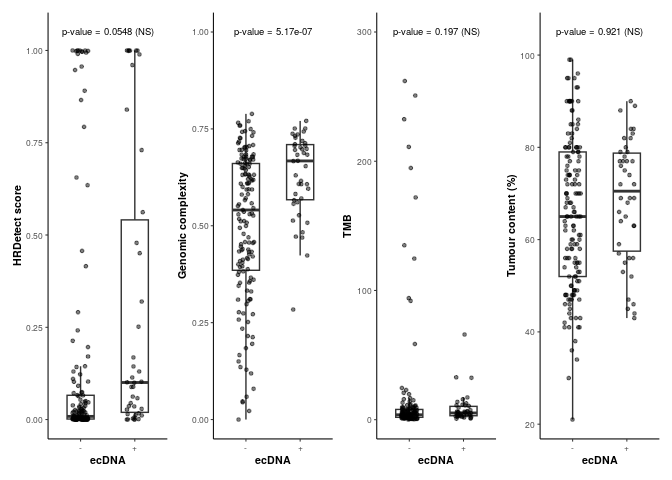

Extended_data_ecDNA_B
================
2023-08-31

## Loading in required packages

``` r
library(tidyverse)
library(patchwork)
```

## Loading in data

``` r
ecDNA_correlates <- read.delim("https://www.bcgsc.ca/downloads/nanopore_pog/ecDNA/Long_POG_ecDNA_correlates.txt", header = T, stringsAsFactors = F)
```

## Composing plot

``` r
set.seed(77)
a <- ggplot(ecDNA_correlates, aes(ecDNA, HRDetect)) + geom_boxplot(width = 0.5, outlier.shape = NA) + geom_jitter(height = 0, width = 0.15, alpha = 0.5, size = 1) + annotate("text", label = "p-value = 0.0548 (NS)", x = 1.5, y = 1.05, size = 2.5) + labs(y = "HRDetect score") + theme_bw(base_size=8) + theme(legend.title = element_blank(), legend.position = "none", axis.title.x = element_text(colour = "black", size = 8, face = "bold"), axis.line.y = element_line(), axis.title.y = element_text(colour = "black", size = 8, face = "bold"), axis.line.x = element_line(),panel.grid.major.x = element_blank(), panel.grid.minor.x = element_blank(),panel.grid.major.y = element_blank(), panel.grid.minor.y = element_blank(), axis.ticks.x = element_line(), plot.background = element_rect(colour = NA), panel.border = element_blank())


b <- ggplot(ecDNA_correlates, aes(ecDNA, genomic_complexity)) + geom_boxplot(width = 0.5, outlier.shape = NA) + geom_jitter(height = 0, width = 0.15, alpha = 0.5, size = 1) + annotate("text", label = "p-value = 5.17e-07", x = 1.5, y = 1, size = 2.5) + labs(y = "Genomic complexity") + theme_bw(base_size=8) + theme(legend.title = element_blank(), legend.position = "none", axis.title.x = element_text(colour = "black", size = 8, face = "bold"), axis.line.y = element_line(), axis.title.y = element_text(colour = "black", size = 8, face = "bold"), axis.line.x = element_line(),panel.grid.major.x = element_blank(), panel.grid.minor.x = element_blank(),
panel.grid.major.y = element_blank(), panel.grid.minor.y = element_blank(), axis.ticks.x = element_line(), plot.background = element_rect(colour = NA), panel.border = element_blank())


c <- ggplot(ecDNA_correlates, aes(ecDNA, TMB)) + geom_boxplot(width = 0.5, outlier.shape = NA) + geom_jitter(height = 0, width = 0.15, alpha = 0.5, size = 1) + annotate("text", label = "p-value = 0.197 (NS)", x = 1.5, y = 300, size = 2.5) + labs(y = "TMB") + theme_bw(base_size=8) + theme(legend.title = element_blank(), legend.position = "none", axis.title.x = element_text(colour = "black", size = 8, face = "bold"), axis.line.y = element_line(), axis.title.y = element_text(colour = "black", size = 8, face = "bold"), axis.line.x = element_line(),panel.grid.major.x = element_blank(), panel.grid.minor.x = element_blank(),panel.grid.major.y = element_blank(), panel.grid.minor.y = element_blank(), axis.ticks.x = element_line(), plot.background = element_rect(colour = NA), panel.border = element_blank())


d <- ggplot(ecDNA_correlates, aes(ecDNA, tumour_content)) + geom_boxplot(width = 0.5, outlier.shape = NA) + geom_jitter(height = 0, width = 0.15, alpha = 0.5, size = 1) + annotate("text", label = "p-value = 0.921 (NS)", x = 1.5, y = 105, size = 2.5) + labs(y = "Tumour content (%)") + theme_bw(base_size=8) + theme(legend.title = element_blank(), legend.position = "none", axis.title.x = element_text(colour = "black", size = 8, face = "bold"), axis.line.y = element_line(), axis.title.y = element_text(colour = "black", size = 8, face = "bold"), axis.line.x = element_line(), panel.grid.major.x = element_blank(), panel.grid.minor.x = element_blank(), panel.grid.major.y = element_blank(), panel.grid.minor.y = element_blank(), axis.ticks.x = element_line(), plot.background = element_rect(colour = NA), panel.border = element_blank())
```

## Printing plot

``` r
#Combine into one plot:
a | b | c | d
```

<!-- -->
