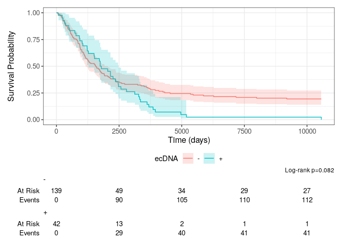

Extended_data_ecDNA_C
================
2023-08-31

## Loading in required packages

``` r
library(tidyverse)
```

    ## ── Attaching core tidyverse packages ──────────────────────── tidyverse 2.0.0 ──
    ## ✔ dplyr     1.1.4     ✔ readr     2.1.5
    ## ✔ forcats   1.0.0     ✔ stringr   1.5.1
    ## ✔ ggplot2   3.4.4     ✔ tibble    3.2.1
    ## ✔ lubridate 1.9.3     ✔ tidyr     1.3.1
    ## ✔ purrr     1.0.2     
    ## ── Conflicts ────────────────────────────────────────── tidyverse_conflicts() ──
    ## ✖ dplyr::filter() masks stats::filter()
    ## ✖ dplyr::lag()    masks stats::lag()
    ## ℹ Use the conflicted package (<http://conflicted.r-lib.org/>) to force all conflicts to become errors

``` r
library(lubridate)
library(survival)
library(ggsurvfit)
```

## Loading in data

``` r
Long_POG_df <- read.delim("https://www.bcgsc.ca/downloads/nanopore_pog/ecDNA/Long_POG_ecDNA_survival.txt", header = T, stringsAsFactors = F)
```

## Composing and printing plot

``` r
survfit2(Surv(time, status) ~ ecDNA, data = Long_POG_df) %>% 
  ggsurvfit() + 
  labs(x = "Time (days)") + 
  add_confidence_interval() + 
  add_pvalue(caption = "Log-rank {p.value}") + 
  add_legend_title() + 
  add_risktable() 
```

<!-- -->
