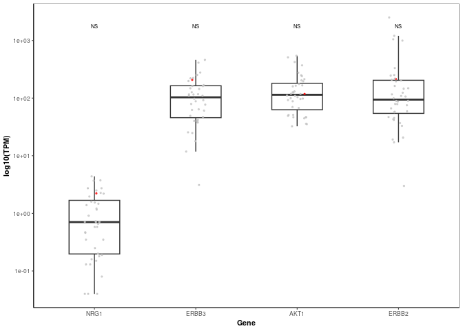

Extended_data_ecDNA_D
================
2023-08-31

## Loading in required packages

``` r
library(tidyverse)
```

    ## ── Attaching core tidyverse packages ──────────────────────── tidyverse 2.0.0 ──
    ## ✔ forcats   1.0.0     ✔ stringr   1.5.1
    ## ✔ lubridate 1.9.3     ✔ tibble    3.2.1
    ## ✔ purrr     1.0.2     ✔ tidyr     1.3.1
    ## ✔ readr     2.1.5     
    ## ── Conflicts ────────────────────────────────────────── tidyverse_conflicts() ──
    ## ✖ dplyr::filter() masks stats::filter()
    ## ✖ dplyr::lag()    masks stats::lag()
    ## ℹ Use the conflicted package (<http://conflicted.r-lib.org/>) to force all conflicts to become errors

## Loading in data

``` r
Long_POG_express_NRG1 <- read.delim("https://www.bcgsc.ca/downloads/nanopore_pog/ecDNA/Long_POG_NRG1_expression.txt", header = T, stringsAsFactors = F)
```

## Composing and printing plot

``` r
ggplot(Long_POG_express_NRG1, aes(x = reorder(gene, TPM), y = TPM)) + geom_boxplot(width = 0.5, outlier.shape = NA) + labs(x = "Gene", y = "log10(TPM)", colour = "") + annotate("text", x = 1, y = 1750, label = "NS", size = 2) + annotate("text", x = 2, y = 1750, label = "NS", size = 2) + annotate("text", x = 3, y = 1750, label = "NS", size = 2) + annotate("text", x = 4, y = 1750, label = "NS", size = 2) + scale_colour_manual(values = c("grey77", "red")) + scale_y_log10() + geom_jitter(size = 0.5, height = 0, width = 0.1, alpha = 0.75, aes(colour = factor(ID))) + theme_bw(base_size=8) + theme(axis.title.x = element_text(colour = "black", size = 8, face = "bold"), axis.line.y = element_line(), axis.title.y = element_text(colour = "black", size = 8, face = "bold"), axis.line.x = element_line(),panel.grid.major.x = element_blank(), panel.grid.minor.x = element_blank(), panel.grid.major.y = element_blank(), panel.grid.minor.y = element_blank(), axis.ticks.x = element_line(), plot.background = element_rect(fill = "white"), legend.position = "Null")
```

<!-- -->
