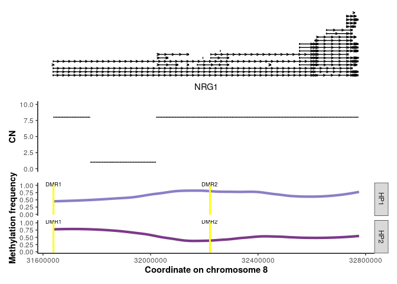

Fig_5G_v2
================
2024-02-06

## Loading in required packages

``` r
library(conflicted)
library(tidyverse)
```

    ## ── Attaching core tidyverse packages ──────────────────────── tidyverse 2.0.0 ──
    ## ✔ dplyr     1.1.4     ✔ readr     2.1.5
    ## ✔ forcats   1.0.0     ✔ stringr   1.5.1
    ## ✔ ggplot2   3.4.4     ✔ tibble    3.2.1
    ## ✔ lubridate 1.9.3     ✔ tidyr     1.3.1
    ## ✔ purrr     1.0.2

``` r
library(ggbio)
```

    ## Warning: package 'ggbio' was built under R version 4.3.1

    ## Loading required package: BiocGenerics

    ## Warning: package 'BiocGenerics' was built under R version 4.3.1

    ## 
    ## Attaching package: 'BiocGenerics'
    ## 
    ## The following objects are masked from 'package:lubridate':
    ## 
    ##     intersect, setdiff, union
    ## 
    ## The following objects are masked from 'package:dplyr':
    ## 
    ##     combine, intersect, setdiff, union
    ## 
    ## The following objects are masked from 'package:stats':
    ## 
    ##     IQR, mad, sd, var, xtabs
    ## 
    ## The following objects are masked from 'package:base':
    ## 
    ##     anyDuplicated, aperm, append, as.data.frame, basename, cbind,
    ##     colnames, dirname, do.call, duplicated, eval, evalq, Filter, Find,
    ##     get, grep, grepl, intersect, is.unsorted, lapply, Map, mapply,
    ##     match, mget, order, paste, pmax, pmax.int, pmin, pmin.int,
    ##     Position, rank, rbind, Reduce, rownames, sapply, setdiff, sort,
    ##     table, tapply, union, unique, unsplit, which.max, which.min
    ## 
    ## Registered S3 method overwritten by 'GGally':
    ##   method from   
    ##   +.gg   ggplot2
    ## Need specific help about ggbio? try mailing 
    ##  the maintainer or visit https://lawremi.github.io/ggbio/

``` r
library(EnsDb.Hsapiens.v86)
```

    ## Warning: package 'EnsDb.Hsapiens.v86' was built under R version 4.3.1

    ## Loading required package: ensembldb

    ## Warning: package 'ensembldb' was built under R version 4.3.1

    ## Loading required package: GenomicRanges

    ## Warning: package 'GenomicRanges' was built under R version 4.3.1

    ## Loading required package: stats4
    ## Loading required package: S4Vectors

    ## Warning: package 'S4Vectors' was built under R version 4.3.1

    ## 
    ## Attaching package: 'S4Vectors'
    ## 
    ## The following objects are masked from 'package:lubridate':
    ## 
    ##     second, second<-
    ## 
    ## The following objects are masked from 'package:dplyr':
    ## 
    ##     first, rename
    ## 
    ## The following object is masked from 'package:tidyr':
    ## 
    ##     expand
    ## 
    ## The following object is masked from 'package:utils':
    ## 
    ##     findMatches
    ## 
    ## The following objects are masked from 'package:base':
    ## 
    ##     expand.grid, I, unname
    ## 
    ## Loading required package: IRanges

    ## Warning: package 'IRanges' was built under R version 4.3.1

    ## 
    ## Attaching package: 'IRanges'
    ## 
    ## The following object is masked from 'package:lubridate':
    ## 
    ##     %within%
    ## 
    ## The following objects are masked from 'package:dplyr':
    ## 
    ##     collapse, desc, slice
    ## 
    ## The following object is masked from 'package:purrr':
    ## 
    ##     reduce
    ## 
    ## Loading required package: GenomeInfoDb

    ## Warning: package 'GenomeInfoDb' was built under R version 4.3.1

    ## Loading required package: GenomicFeatures

    ## Warning: package 'GenomicFeatures' was built under R version 4.3.1

    ## Loading required package: AnnotationDbi

    ## Warning: package 'AnnotationDbi' was built under R version 4.3.1

    ## Loading required package: Biobase

    ## Warning: package 'Biobase' was built under R version 4.3.1

    ## Welcome to Bioconductor
    ## 
    ##     Vignettes contain introductory material; view with
    ##     'browseVignettes()'. To cite Bioconductor, see
    ##     'citation("Biobase")', and for packages 'citation("pkgname")'.
    ## 
    ## 
    ## Attaching package: 'AnnotationDbi'
    ## 
    ## The following object is masked from 'package:dplyr':
    ## 
    ##     select
    ## 
    ## Loading required package: AnnotationFilter

    ## Warning: package 'AnnotationFilter' was built under R version 4.3.1

    ## 
    ## Attaching package: 'ensembldb'
    ## 
    ## The following object is masked from 'package:dplyr':
    ## 
    ##     filter
    ## 
    ## The following object is masked from 'package:stats':
    ## 
    ##     filter

``` r
library(patchwork)
conflicts_prefer(ggbio::autoplot)
```

    ## [conflicted] Will prefer ggbio::autoplot over any other package.

``` r
conflicts_prefer(ggplot2::xlim)
```

    ## [conflicted] Will prefer ggplot2::xlim over any other package.

``` r
conflicts_prefer(ggplot2::geom_rect)
```

    ## [conflicted] Will prefer ggplot2::geom_rect over any other package.

``` r
conflicts_prefer(ggbio::geom_segment)
```

    ## [conflicted] Will prefer ggbio::geom_segment over any other package.

## Loading in data

``` r
#Methylation frequency for sample of interest separated by haplotype for NRG1 region:
Methyl_freq_NRG1 <- read.delim("https://www.bcgsc.ca/downloads/nanopore_pog/ecDNA/POG816_NRG1_haplotype_methylation_source_table.txt", header = T, stringsAsFactors = F)

#CN calls from Ploidetect for sample of interest for NRG1 region:
CN_NRG1 <- read.delim("https://www.bcgsc.ca/downloads/nanopore_pog/ecDNA/POG816_NRG1_CN_ploidetect_source_table.txt", header = T, stringsAsFactors = F)
```

## Composing plot

``` r
#Define colours to be used in plot:
colours <- c("#8A7EC7", "#7C3A88")

#Gene annotation for NRG1:
gr <- GRanges(seqnames = 8, IRanges(31637245, 32776046), strand = "*")
ensdb <- EnsDb.Hsapiens.v86

r <- autoplot(ensdb, GRangesFilter(gr), names.expr = "NRG1", xlab = "NRG1", label = FALSE) + theme_bw(base_size=11) + theme(legend.title = element_blank(), legend.position = "none", axis.title.x = element_text(colour = "black", size = 11), axis.line.y = element_blank(), 
axis.title.y = element_text(colour = "black", size = 11, face = "bold"), axis.line.x = element_blank(), panel.grid.major.x = element_blank(), panel.grid.minor.x = element_blank(), axis.text.x = element_blank(), panel.grid.minor.y = element_blank(), axis.ticks.x = element_blank(), plot.background = element_rect(colour = NA), panel.border = element_blank())
```

    ## Fetching data...OK
    ## Parsing exons...OK
    ## Defining introns...OK
    ## Defining UTRs...OK
    ## Defining CDS...OK
    ## aggregating...
    ## Done
    ## Constructing graphics...

``` r
#Methylation frequency for NRG1 separated by haplotype (ID column):
q <- ggplot(Methyl_freq_NRG1, aes(start, MethylFreq, fill = ID)) + 
  xlim(31637245, 32776046) + 
  geom_smooth(method="loess", aes(colour = ID), se=F, size=1.5, span=0.5) + 
  scale_colour_manual(values = colours) + 
  annotate("text", label = "DMR1", x = 31639573, y = 1.04, size = 2.5) + 
  annotate("text", label = "DMR2", x = 32219817, y = 1.04, size = 2.5) + 
  scale_fill_manual(values = colours) + 
  labs(x = "Coordinate on chromosome 8", y = "Methylation frequency", fill = "Haplotype") + 
  theme_bw(base_size=11) + 
  theme(legend.title = element_blank(), 
        legend.position = "none", 
        axis.title.x = element_text(colour = "black", size = 11, face = "bold"), 
        axis.line.y = element_line(), 
        axis.title.y = element_text(colour = "black", size = 11, face = "bold"), 
        axis.line.x = element_line(), 
        panel.grid.major.x = element_blank(), 
        panel.grid.minor.x = element_blank(), 
        panel.grid.major.y = element_blank(), 
        panel.grid.minor.y = element_blank(), 
        axis.ticks.x = element_line(), 
        plot.background = element_rect(colour = NA), 
        panel.border = element_blank())
```

    ## Warning: Using `size` aesthetic for lines was deprecated in ggplot2 3.4.0.
    ## ℹ Please use `linewidth` instead.
    ## This warning is displayed once every 8 hours.
    ## Call `lifecycle::last_lifecycle_warnings()` to see where this warning was
    ## generated.

``` r
#Adding in two promoter DMR annotations:
s <- q + 
  geom_rect(xmin = 31638222, xmax = 31639221, ymin = 0, ymax = 1, colour = "yellow") + 
  geom_rect(xmin = 32220042, xmax = 32221041, ymin = 0, ymax = 1, colour = "yellow")

#Faceting by haplotype:
t <- s + facet_grid(rows = vars(ID))

#Adding in CN track:
u <- ggplot(CN_NRG1, aes(pos, CN)) + scale_x_continuous(limits = c(31637245, 32776046)) + ylim(0,10) + geom_segment(aes(x = pos, y = CN, xend = end, yend = CN), data = CN_NRG1) + theme_bw(base_size=11) + theme(legend.title = element_text(), axis.title.x = element_blank(), axis.line.y = element_line(), axis.title.y = element_text(colour = "black", size = 11, face = "bold"), axis.line.x = element_blank(),panel.grid.major.x = element_blank(), panel.grid.minor.x = element_blank(), axis.text.x = element_blank(), panel.grid.major.y = element_blank(), panel.grid.minor.y = element_blank(), axis.ticks.x = element_blank(), plot.background = element_rect(colour = NA), panel.border = element_blank())

#Combining plots together into one plot
patch <- (r@ggplot / u / t )
```

## Printing plot

``` r
patch
```

    ## Warning: Removed 39225 rows containing missing values (`geom_segment()`).

    ## `geom_smooth()` using formula = 'y ~ x'

<!-- -->
